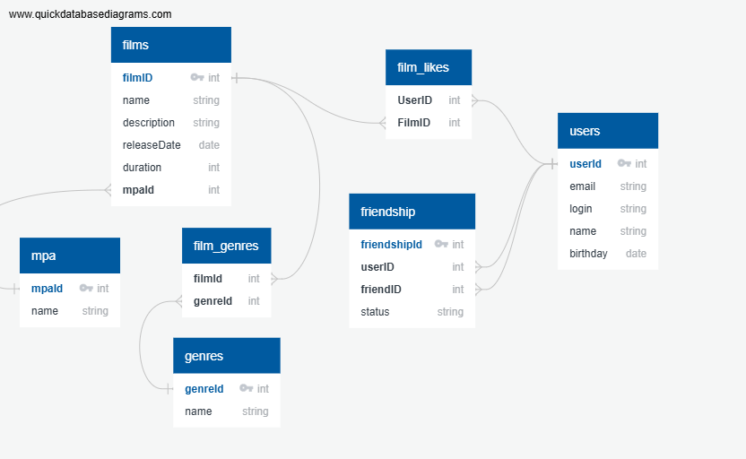

# java-filmorate
Template repository for Filmorate project.

## Схема базы данных


# SQL Примеры для проекта "Фильмы и пользователи"
В этом файле приведены основные SQL-запросы для работы с таблицами:  
`films`, `genres`, `film_genres`, `users`, `film_likes`, `friendship`, `mpa`.

---

## Таблица `films`
### Добавить фильм
```sql
INSERT INTO films (name, description, releaseDate, duration, mpaId)
VALUES ('Inception', 'A mind-bending sci-fi thriller', '2010-07-16', 148, 3);
```

### Получить топ-10 популярных фильмов:
```sql
SELECT f.filmId, f.name, COUNT(fl.userId) as likes_count
FROM films f
LEFT JOIN film_likes fl ON f.filmId = fl.filmId
GROUP BY f.filmId, f.name
ORDER BY likes_count DESC
LIMIT 10;
```

---

## Таблица `users`
### Добавить пользователя
```sql
INSERT INTO users (email, login, name, birthday)
VALUES ('user@example.com', 'moviefan', 'Alex Filmlover', '1995-05-15');
```

### Получить всех пользователей
```sql
SELECT * FROM users;
```